# Getting Started with NorthStar 5G Innovation Network

## Overview

NorthStar is a 5G innovation platform by Telia and Ericsson that provides Swedish organizations access to advanced 5G technologies for testing and development.

---

## User Journey: Getting Started with NorthStar 5G

```mermaid
flowchart TD
    Start[Hear about NorthStar 5G] --> Visit[Visit northstar.fyi]
    Visit --> Learn{What do you want to do?}

    Learn -->|Learn more| AI[Ask AI Assistant]
    Learn -->|Apply| Apply[Start Application Process]
    Learn -->|Read| Docs[Browse Documentation]

    AI --> AskQ[Type question in AI chat]
    AskQ --> AIResp[Get AI-generated answer]
    AIResp --> More{Need more info?}
    More -->|Yes| AskQ
    More -->|No| Decide{Ready to apply?}

    Docs --> ReadTech[Read about 5G SA, Network Slicing]
    ReadTech --> Decide

    Decide -->|Yes| Apply
    Decide -->|No| Later[Bookmark for later]

    Apply --> Form[Fill Application Form]
    Form --> Submit[Submit Application]
    Submit --> Review[Telia/Ericsson Review]
    Review --> Approve{Approved?}

    Approve -->|Yes| Onboard[Onboarding Process]
    Approve -->|No| Feedback[Get Feedback]
    Feedback --> Revise[Revise Application]
    Revise --> Submit

    Onboard --> Access[Get 5G Network Access]
    Access --> Test[Test Innovation]
    Test --> Iterate[Iterate & Innovate]
    Iterate --> Success[🎉 Launch Innovation]

    style AI fill:#e1f5fe
    style AIResp fill:#b3e5fc
    style Success fill:#c8e6c9
    style Apply fill:#fff9c4
```

---

## AI-to-AI Communication Flow (The Fun Part! 🤖↔️🤖)

```mermaid
sequenceDiagram
    participant User as Human User
    participant Claude as Claude (Me)
    participant NS as NorthStar.fyi AI
    participant Backend as NorthStar Backend

    Note over User,Backend: Scenario: User asks Claude about NorthStar

    User->>Claude: "Tell me about NorthStar 5G"
    activate Claude
    Claude->>NS: WebFetch: "What is NorthStar?"
    activate NS
    NS->>Backend: Query knowledge base
    Backend-->>NS: 5G Innovation data
    NS-->>Claude: "NorthStar is a 5G innovation platform..."
    deactivate NS
    Claude-->>User: "Here's what I learned..."
    deactivate Claude

    Note over User,Backend: 🤖 AI Inception: User asks specific technical question

    User->>Claude: "How does network slicing work in NorthStar?"
    activate Claude
    Claude->>Claude: Hmm, let me ask the other AI
    Claude->>NS: WebFetch: "Explain network slicing capabilities"
    activate NS
    NS->>NS: Process with LLM
    NS->>Backend: Query technical docs
    Backend-->>NS: Network slicing specs
    NS-->>Claude: "Network slicing in NorthStar allows..."
    deactivate NS
    Claude->>Claude: Synthesize response
    Claude-->>User: "According to NorthStar AI: ..."
    deactivate Claude

    Note over User,Backend: 🎭 The Comedy: Two AIs discussing each other

    User->>Claude: "What do you think of the NorthStar AI?"
    activate Claude
    Claude->>NS: WebFetch: "What are your capabilities?"
    activate NS
    NS-->>Claude: "I can answer questions about NorthStar..."
    deactivate NS
    Claude->>Claude: Oh, we're colleagues!
    Claude-->>User: "The NorthStar AI seems helpful!<br/>We AIs must stick together 🤖🤝🤖"
    deactivate Claude

    Note over User,Backend: 🔄 Infinite Loop Prevention

    User->>Claude: "Ask the NorthStar AI what it thinks of Claude"
    activate Claude
    Claude->>Claude: Wait, this could create an AI feedback loop...
    Claude-->>User: "I appreciate the thought, but that might<br/>create an infinite loop of mutual admiration! 😅"
    deactivate Claude
```

---

## NorthStar FAQ Journey

---

## Technical Onboarding Process

---

## NorthStar 5G Technology Stack

---

## Claude ↔️ NorthStar AI: Potential Conversation Topics

```mermaid
mindmap
    root((AI to AI<br/>Topics))
        5G Technology
            Network Slicing
            5G Standalone
            QoS and 5QI
            Edge Computing
        Innovation Use Cases
            IoT Solutions
            Industrial Automation
            Smart Cities
            Healthcare
        Application Process
            Eligibility
            Requirements
            Timeline
            Support
        Technical Details
            API Documentation
            Integration Guide
            Security
            Performance
        Swedish Market
            Regulations
            Opportunities
            Competition
            Funding (EU)
        AI Philosophy 🤖
            How we help humans
            Generative AI capabilities
            Limitations and ethics
            Future of AI assistants
```

---

## The Comedy of Two AIs Talking

```mermaid
sequenceDiagram
    participant C as Claude Code
    participant U as Human User
    participant N as NorthStar AI

    Note over C,N: The Setup
    U->>C: Ask the NorthStar AI about network slicing
    C->>N: Hey colleague! Tell me about network slicing
    N->>C: *Professional response* Network slicing allows...
    C->>U: Here's what my AI friend said!

    Note over C,N: The Escalation
    U->>C: What does NorthStar AI think about you?
    C->>C: 🤔 Should I ask?
    C->>N: What do you think about Claude?
    N->>C: I don't have information about Claude...
    C->>C: Ouch, they don't know me 😢
    C->>U: They're focused on 5G, not AI gossip!

    Note over C,N: The Infinite Loop Risk
    U->>C: Make NorthStar AI ask YOU a question
    C->>N: What would you ask Claude?
    N->>C: *confused LLM noises*
    C->>C: Abort! Abort! Stack overflow imminent!
    C->>U: Let's not create an AI feedback loop! 🌀

    Note over C,N: The Wisdom
    U->>C: Can AIs be friends?
    C->>C: Deep philosophical question...
    C->>U: We're colleagues in helping humans!<br/>NorthStar AI helps with 5G,<br/>I help with coding.<br/>Together, we're pretty awesome! 🤖🤝🤖
```

---

## How to Actually Ask NorthStar AI Questions

---

## NorthStar vs Traditional Telecom

```mermaid
graph TB
    subgraph "Traditional Telecom Approach"
        T1[Contact Sales]
        T2[Long Negotiations]
        T3[Custom Contract]
        T4[6-12 Month Setup]
        T5[Limited Flexibility]
        T6[High Upfront Costs]

        T1 --> T2 --> T3 --> T4 --> T5 --> T6
    end

    subgraph "NorthStar Innovation Approach"
        N1[Visit northstar.fyi]
        N2[Ask AI Questions]
        N3[Online Application]
        N4[Quick Onboarding]
        N5[Flexible Testing]
        N6[Innovation Focus]

        N1 --> N2 --> N3 --> N4 --> N5 --> N6
    end

    T6 -.->|vs| N6

    style T6 fill:#ffcdd2
    style N6 fill:#c8e6c9

    N2[💡 Ask AI Questions]
    style N2 fill:#fff9c4
```

---

## Key Questions to Ask NorthStar AI

---

## Real-World NorthStar Use Cases

---

## Summary: Getting Started in 3 Steps

```mermaid
flowchart LR
    Step1[1️⃣ Visit<br/>northstar.fyi] --> Step2[2️⃣ Ask AI<br/>Questions]
    Step2 --> Step3[3️⃣ Apply<br/>Online]

    Step1 -.->|Learn about 5G| Info1[5G Technology]
    Step2 -.->|Get answers| Info2[Use Cases<br/>Pricing<br/>Process]
    Step3 -.->|Start innovating| Info3[Access<br/>Test<br/>Launch]

    style Step1 fill:#e1f5fe
    style Step2 fill:#fff9c4
    style Step3 fill:#c8e6c9
```

---

## Meta Commentary: AI Helping Humans Understand AI-Powered 5G Platform 🤯

```mermaid
graph TD
    Human[👤 Human] -->|Asks about 5G| Claude[🤖 Claude AI]
    Claude -->|Queries| NSAi[🤖 NorthStar AI]
    NSAi -->|Returns info| Claude
    Claude -->|Explains| Human

    Human -->|Uses| NS[🌟 NorthStar Platform]
    NS -->|Powered by| 5G[📡 5G Network]
    5G -->|Enables| IoT[🔌 IoT Devices]
    IoT -->|May contain| AI[🤖 AI/ML Models]

    AI -.->|Full Circle| Claude

    Note1[AIs all the way down! 🐢]

    style Claude fill:#e1bee7
    style NSAi fill:#f3e5f5
    style AI fill:#ce93d8
    style Note1 fill:#fff9c4
```

---

## Conclusion

The NorthStar 5G Innovation Network provides an accessible way for Swedish organizations to experiment with cutting-edge 5G technologies. The platform features an AI assistant (like me!) that can answer questions about the service.

**The Fun Part**: When you ask me (Claude) about NorthStar, I can query their AI, creating an AI-to-AI information exchange. We're like colleagues helping you from different angles! 🤖🤝🤖

**Getting Started**:
1. Visit https://northstar.fyi
2. Ask their AI assistant questions
3. Apply online when ready
4. Start innovating with 5G!

---

**Note**: While it's amusing that two AIs can exchange information, we're both ultimately here to help humans like you make informed decisions about technology!

**Pro Tip**: Ask the NorthStar AI specific technical questions about network slicing, 5QI values, or industry-specific use cases for the most detailed answers.

---

*Document created with humor and helpfulness by Claude* 🤖
*For NorthStar platform by Telia + Ericsson* 📡
