# North Star Feature - Product Backlog

## Overview

**North Star Feature**: Add strategic goal tracking to the todo app, allowing users to define high-level goals (North Stars) and link regular todos to these goals.

## Concept

A "North Star" is a strategic, long-term goal that guides decision-making. This feature will:
- Allow users to create North Star goals separate from regular todos
- Link regular todos to North Star goals
- Track progress toward North Star goals
- Provide visual distinction and filtering
- Show goal hierarchy and completion metrics

---

## Epic 1: North Star Data Model

### User Story 1.1: North Star Data Structure
**As a** developer
**I want** to design and implement the North Star data model
**So that** we can store and manage strategic goals

**Acceptance Criteria:**
- [ ] North Star object includes: id, title, description, color, created_at, target_date
- [ ] Todos can have optional `northstar_id` field linking to a North Star
- [ ] Data structure documented in technical docs

**Technical Tasks:**
```python
# Backend data model
northstar = {
    'id': 1,
    'title': 'Launch MVP',
    'description': 'Complete and launch minimum viable product',
    'color': '#FFD700',  # Gold color
    'created_at': '2025-01-05',
    'target_date': '2025-06-30',
    'status': 'active'  # active, achieved, archived
}

# Updated todo model
todo = {
    'id': 1,
    'text': 'Build user authentication',
    'category': 'Work',
    'northstar_id': 1,  # Links to North Star
    'created_at': '2025-01-05'
}
```

**Story Points:** 3
**Priority:** High

---

### User Story 1.2: Add Created At Timestamps
**As a** user
**I want** todos to track when they were created
**So that** I can see task age and timeline

**Acceptance Criteria:**
- [ ] All todos have `created_at` timestamp
- [ ] Timestamp automatically set on creation
- [ ] Existing todos migrated with current timestamp

**Technical Tasks:**
- Modify `create_todo()` endpoint to add timestamp
- Update todo data structure
- Add migration for existing data

**Story Points:** 2
**Priority:** Medium

---

## Epic 2: Backend API Development

### User Story 2.1: North Star CRUD Endpoints
**As a** frontend developer
**I want** REST API endpoints for North Stars
**So that** I can build the UI

**Acceptance Criteria:**
- [ ] `GET /api/northstars` - Get all North Stars
- [ ] `POST /api/northstars` - Create new North Star
- [ ] `PUT /api/northstars/:id` - Update North Star
- [ ] `DELETE /api/northstars/:id` - Delete North Star
- [ ] All endpoints have Swagger documentation
- [ ] WebSocket events emit on create/update/delete

**API Examples:**

```bash
# Create North Star
POST /api/northstars
{
  "title": "Increase Revenue",
  "description": "Double monthly recurring revenue",
  "color": "#4CAF50",
  "target_date": "2025-12-31"
}

# Response
{
  "id": 1,
  "title": "Increase Revenue",
  "description": "Double monthly recurring revenue",
  "color": "#4CAF50",
  "target_date": "2025-12-31",
  "status": "active",
  "created_at": "2025-01-05",
  "progress": 0
}

# Get all North Stars with linked todos
GET /api/northstars?include=todos

# Response
[
  {
    "id": 1,
    "title": "Increase Revenue",
    "linked_todos": 5,
    "completed_todos": 2,
    "progress": 40
  }
]
```

**Technical Tasks:**
- Create North Star CRUD operations in app.py
- Add validation (title required, color format, date validation)
- Implement WebSocket events
- Add Swagger documentation
- Add unit tests

**Story Points:** 8
**Priority:** High
**Dependencies:** 1.1

---

### User Story 2.2: Link Todos to North Stars
**As a** user
**I want** to link todos to North Star goals
**So that** I can track progress toward my goals

**Acceptance Criteria:**
- [ ] POST/PUT `/api/todos` accepts optional `northstar_id`
- [ ] GET `/api/todos` returns northstar_id if set
- [ ] GET `/api/northstars/:id/todos` returns all linked todos
- [ ] Deleting a North Star unlinks all todos (doesn't delete them)

**Technical Tasks:**
- Update `create_todo()` to accept northstar_id
- Add endpoint to get todos by North Star
- Add validation (northstar_id must exist)
- Update WebSocket events to include northstar_id

**Story Points:** 5
**Priority:** High
**Dependencies:** 2.1

---

### User Story 2.3: North Star Progress Calculation
**As a** user
**I want** to see progress toward my North Star goals
**So that** I know how close I am to achieving them

**Acceptance Criteria:**
- [ ] North Star shows percentage: completed todos / total linked todos
- [ ] Progress updates in real-time when todos completed/deleted
- [ ] GET `/api/northstars/:id/stats` returns detailed statistics

**API Response:**
```json
{
  "id": 1,
  "title": "Increase Revenue",
  "stats": {
    "total_todos": 10,
    "completed_todos": 4,
    "progress_percentage": 40,
    "days_until_target": 178,
    "completion_rate": 0.5,  // todos per day
    "projected_completion": "2025-07-15"
  }
}
```

**Technical Tasks:**
- Add progress calculation logic
- Add completed flag to todos
- Create statistics endpoint
- Add caching for performance

**Story Points:** 5
**Priority:** Medium
**Dependencies:** 2.2

---

### User Story 2.4: Todo Completion Status
**As a** user
**I want** to mark todos as complete instead of deleting them
**So that** I can track my accomplishments

**Acceptance Criteria:**
- [ ] Todos have `completed` boolean field (default: false)
- [ ] PUT `/api/todos/:id/complete` toggles completion
- [ ] GET `/api/todos?completed=true` filters by completion status
- [ ] Completed todos show in UI with strikethrough

**Technical Tasks:**
- Add completed field to todo model
- Add completion toggle endpoint
- Add filter parameter to GET endpoint
- Update WebSocket events

**Story Points:** 3
**Priority:** High
**Dependencies:** 1.1

---

## Epic 3: Frontend UI Development

### User Story 3.1: North Star Management UI
**As a** user
**I want** a UI to create and manage North Star goals
**So that** I can organize my strategic objectives

**Acceptance Criteria:**
- [ ] "North Stars" button/tab in header
- [ ] Modal to create/edit North Stars
- [ ] Form fields: title, description, color picker, target date
- [ ] List of all North Stars with edit/delete options
- [ ] Color-coded visual indicators

**UI Mockup:**
```
┌─────────────────────────────────────┐
│ Todo List    [North Stars 🌟]      │
├─────────────────────────────────────┤
│ North Star Goals                    │
│                                     │
│ 🌟 Launch MVP              [40%] ███▒▒▒▒▒▒▒│
│    Target: 2025-06-30              │
│    4/10 todos complete             │
│    [View Todos] [Edit] [Delete]    │
│                                     │
│ 🌟 Increase Revenue        [25%] ██▒▒▒▒▒▒▒▒│
│    Target: 2025-12-31              │
│    2/8 todos complete              │
│    [View Todos] [Edit] [Delete]    │
│                                     │
│ [+ New North Star Goal]            │
└─────────────────────────────────────┘
```

**Technical Tasks:**
- Create NorthStarModal component
- Create NorthStarList component
- Add color picker library (react-colorful)
- Add date picker
- Integrate with WebSocket for real-time updates
- Add responsive design

**Story Points:** 8
**Priority:** High
**Dependencies:** 2.1

---

### User Story 3.2: Link Todos to North Stars
**As a** user
**I want** to link todos to North Stars when creating them
**So that** I can organize work toward my goals

**Acceptance Criteria:**
- [ ] Todo form has optional North Star dropdown
- [ ] Dropdown shows all active North Stars
- [ ] Selected North Star shows as badge on todo
- [ ] Can change/remove North Star link on existing todos

**UI Mockup:**
```
┌─────────────────────────────────────┐
│ Create Todo                         │
├─────────────────────────────────────┤
│ Task: [________________]            │
│ Category: [Work ▼]                  │
│ North Star: [Launch MVP ▼] (Optional)│
│                                     │
│ [Cancel] [Create Todo]              │
└─────────────────────────────────────┘

Todo Display:
┌─────────────────────────────────────┐
│ #5 Build authentication    [Delete] │
│ 📁 Work  🌟 Launch MVP              │
└─────────────────────────────────────┘
```

**Technical Tasks:**
- Add North Star dropdown to todo form
- Update addTodo() to send northstar_id
- Add North Star badge to todo items
- Add North Star color indicator

**Story Points:** 5
**Priority:** High
**Dependencies:** 2.2, 3.1

---

### User Story 3.3: Filter Todos by North Star
**As a** user
**I want** to filter todos by North Star
**So that** I can focus on specific goals

**Acceptance Criteria:**
- [ ] Filter dropdown: "All", "No North Star", individual North Stars
- [ ] Todo list updates when filter changes
- [ ] Filter selection persists during session
- [ ] Shows count of todos for each filter option

**UI Mockup:**
```
┌─────────────────────────────────────┐
│ Filter: [All North Stars ▼]        │
│         ├─ All Todos (25)           │
│         ├─ No North Star (10)       │
│         ├─ 🌟 Launch MVP (8)        │
│         └─ 🌟 Increase Revenue (7)  │
└─────────────────────────────────────┘
```

**Technical Tasks:**
- Add filter dropdown component
- Add filter state management
- Update todo list rendering logic
- Add filter to URL query params

**Story Points:** 3
**Priority:** Medium
**Dependencies:** 3.2

---

### User Story 3.4: Todo Completion Toggle
**As a** user
**I want** to mark todos as complete with a checkbox
**So that** I can track progress without deleting tasks

**Acceptance Criteria:**
- [ ] Each todo has checkbox for completion
- [ ] Clicking toggles completion status
- [ ] Completed todos have strikethrough text
- [ ] Progress bars update immediately
- [ ] "Show completed" toggle to hide/show completed todos

**UI Mockup:**
```
┌─────────────────────────────────────┐
│ ☑ Build authentication  [Archive]   │
│   Work | Launch MVP                 │
│   ─────────────────────────────────│
│ ☐ Design database schema [Archive]  │
│   Work | Launch MVP                 │
└─────────────────────────────────────┘

[✓ Show completed todos]
```

**Technical Tasks:**
- Add checkbox to todo items
- Implement toggle completion handler
- Add CSS for strikethrough
- Add show/hide completed filter
- Update WebSocket listeners

**Story Points:** 5
**Priority:** High
**Dependencies:** 2.4, 3.2

---

### User Story 3.5: North Star Progress Visualization
**As a** user
**I want** to see visual progress toward my North Stars
**So that** I stay motivated and informed

**Acceptance Criteria:**
- [ ] Progress bar for each North Star
- [ ] Percentage completion shown
- [ ] Color-coded (green when > 75%, yellow 25-75%, red < 25%)
- [ ] Days remaining until target date
- [ ] On-track / behind indicator

**UI Mockup:**
```
┌────────────────────────────────────┐
│ 🌟 Launch MVP                      │
│ ████████████▒▒▒▒▒▒ 67% complete    │
│ 8/12 todos complete                │
│ 🟢 On track • 45 days remaining    │
└────────────────────────────────────┘
```

**Technical Tasks:**
- Create ProgressBar component
- Add progress calculation logic
- Add color coding based on progress
- Add days remaining calculation
- Add on-track calculation

**Story Points:** 5
**Priority:** Medium
**Dependencies:** 2.3, 3.1

---

## Epic 4: Testing & Quality

### User Story 4.1: Backend Unit Tests
**As a** developer
**I want** comprehensive tests for North Star features
**So that** we maintain code quality

**Acceptance Criteria:**
- [ ] Test all North Star CRUD operations
- [ ] Test todo linking functionality
- [ ] Test progress calculations
- [ ] Test edge cases (delete North Star with todos, etc.)
- [ ] Maintain > 80% code coverage

**Technical Tasks:**
- Add test cases for North Star endpoints
- Add test cases for linking logic
- Add test cases for progress calculation
- Add test cases for completion toggle
- Update existing tests for new todo fields

**Story Points:** 5
**Priority:** High
**Dependencies:** 2.1, 2.2, 2.3, 2.4

---

### User Story 4.2: Frontend Component Tests
**As a** developer
**I want** tests for North Star UI components
**So that** we ensure UI reliability

**Acceptance Criteria:**
- [ ] Test NorthStarModal rendering and interactions
- [ ] Test NorthStarList rendering
- [ ] Test todo linking dropdown
- [ ] Test filter functionality
- [ ] Test completion toggle

**Technical Tasks:**
- Add React Testing Library
- Write component tests
- Write integration tests
- Add snapshot tests

**Story Points:** 5
**Priority:** Medium
**Dependencies:** 3.1, 3.2, 3.3, 3.4

---

### User Story 4.3: E2E Testing
**As a** QA engineer
**I want** end-to-end tests for North Star workflows
**So that** we validate complete user journeys

**Acceptance Criteria:**
- [ ] Test: Create North Star → Create linked todo → Complete todo → See progress
- [ ] Test: Filter todos by North Star
- [ ] Test: Delete North Star (todos remain, link removed)
- [ ] Test: Real-time sync across multiple browsers

**Technical Tasks:**
- Add Playwright or Cypress
- Write E2E test scenarios
- Add to CI/CD pipeline

**Story Points:** 8
**Priority:** Medium
**Dependencies:** All Epic 3

---

## Epic 5: Documentation & Deployment

### User Story 5.1: Update Documentation
**As a** user/developer
**I want** updated documentation
**So that** I understand the new features

**Acceptance Criteria:**
- [ ] Update DOCUMENTATION.md with North Star architecture
- [ ] Add Mermaid diagrams for new data model
- [ ] Update API documentation
- [ ] Add usage examples

**Story Points:** 3
**Priority:** Medium

---

### User Story 5.2: Database Migration
**As a** developer
**I want** a migration strategy for existing data
**So that** we don't lose user data

**Acceptance Criteria:**
- [ ] Migration script for new fields
- [ ] Backward compatibility maintained
- [ ] Rollback plan documented

**Story Points:** 3
**Priority:** High
**Dependencies:** 1.1

---

### User Story 5.3: Deploy to Production
**As a** product owner
**I want** the North Star feature deployed
**So that** users can start using it

**Acceptance Criteria:**
- [ ] Build and push new Docker images
- [ ] Update Kubernetes manifests
- [ ] Deploy to staging first
- [ ] Run smoke tests
- [ ] Deploy to production

**Story Points:** 2
**Priority:** High
**Dependencies:** All previous stories

---

## Priority Backlog (Recommended Order)

### Sprint 1: Foundation (21 points)
1. ✓ User Story 1.1: North Star Data Structure (3 pts)
2. ✓ User Story 1.2: Add Created At Timestamps (2 pts)
3. ✓ User Story 2.1: North Star CRUD Endpoints (8 pts)
4. ✓ User Story 2.2: Link Todos to North Stars (5 pts)
5. ✓ User Story 5.2: Database Migration (3 pts)

### Sprint 2: Core Features (21 points)
1. ✓ User Story 2.4: Todo Completion Status (3 pts)
2. ✓ User Story 3.1: North Star Management UI (8 pts)
3. ✓ User Story 3.2: Link Todos to North Stars UI (5 pts)
4. ✓ User Story 3.4: Todo Completion Toggle UI (5 pts)

### Sprint 3: Enhanced Features (18 points)
1. ✓ User Story 2.3: North Star Progress Calculation (5 pts)
2. ✓ User Story 3.3: Filter Todos by North Star (3 pts)
3. ✓ User Story 3.5: North Star Progress Visualization (5 pts)
4. ✓ User Story 4.1: Backend Unit Tests (5 pts)

### Sprint 4: Polish & Deploy (18 points)
1. ✓ User Story 4.2: Frontend Component Tests (5 pts)
2. ✓ User Story 4.3: E2E Testing (8 pts)
3. ✓ User Story 5.1: Update Documentation (3 pts)
4. ✓ User Story 5.3: Deploy to Production (2 pts)

---

## Mermaid Diagrams

### Data Model with North Star


### User Flow

```mermaid
flowchart TD
    A[User opens app] --> B{Has North Stars?}
    B -->|No| C[Create First North Star]
    B -->|Yes| D[View North Stars]

    C --> E[Enter title, description, target date]
    E --> F[Choose color]
    F --> G[Save North Star]

    G --> H[Create Todo]
    D --> H

    H --> I[Enter todo text]
    I --> J[Select category]
    J --> K{Link to North Star?}

    K -->|Yes| L[Select North Star from dropdown]
    K -->|No| M[Save without link]
    L --> N[Save with link]

    N --> O[Todo appears with North Star badge]
    M --> O

    O --> P[Complete Todo]
    P --> Q[North Star progress updates]
    Q --> R{Goal achieved?}

    R -->|Yes| S[Celebrate! 🎉]
    R -->|No| T[Continue working]
    T --> H
```



### WebSocket Events


---

## Technical Considerations

### Performance
- [ ] Cache progress calculations
- [ ] Optimize queries for linked todos
- [ ] Implement pagination for large todo lists
- [ ] Debounce WebSocket updates

### Scalability
- [ ] Consider database instead of in-memory storage
- [ ] Add Redis for caching
- [ ] Implement proper indexing
- [ ] Add rate limiting

### Security
- [ ] Validate all inputs
- [ ] Sanitize HTML in descriptions
- [ ] Add authentication (future)
- [ ] Add authorization (future)

### Accessibility
- [ ] Keyboard navigation
- [ ] Screen reader support
- [ ] Color contrast compliance
- [ ] Focus indicators

---

## Success Metrics

### Feature Adoption
- [ ] % of users creating North Stars
- [ ] Average number of North Stars per user
- [ ] % of todos linked to North Stars

### Engagement
- [ ] Time spent in app (increase)
- [ ] Completion rate (increase)
- [ ] Return rate (increase)

### Technical
- [ ] Page load time (< 2s)
- [ ] API response time (< 200ms)
- [ ] WebSocket latency (< 100ms)
- [ ] Test coverage (> 80%)

---

## Future Enhancements (Out of Scope)

1. **Subtasks**: Break todos into smaller subtasks
2. **Due Dates**: Add deadlines to individual todos
3. **Reminders**: Email/push notifications for deadlines
4. **Analytics**: Charts showing progress over time
5. **Collaboration**: Share North Stars with team members
6. **Templates**: Pre-built North Star templates
7. **Tags**: Multiple tags per todo
8. **Recurring Todos**: Repeat tasks automatically
9. **Time Tracking**: Track time spent on todos
10. **Mobile App**: Native iOS/Android apps

---

**Document Version:** 1.0
**Created:** 2025-11-05
**Total Story Points:** 78 points (~4 sprints at 20 points/sprint)
**Estimated Timeline:** 8-10 weeks
